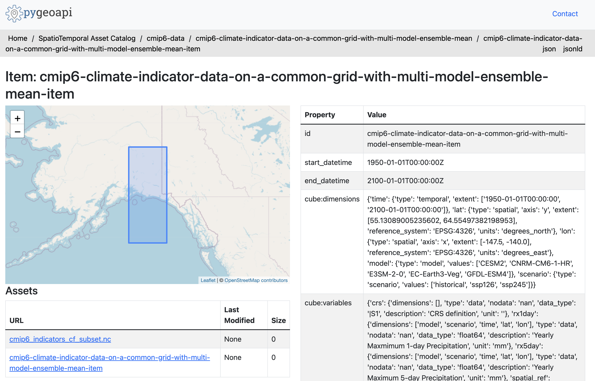

The STAC catalog created by `datacube_to_STAC.ipynb` can be exposed via a `pygeoapi` application. 

To install and run a local instance of the application, follow the instructions here: https://docs.pygeoapi.io/en/latest/installation.html

You can use the `example-config.yml` file included here to direct the application towards the local STAC catalog resource (`/cmip6_stac`) created by `datacube_to_STAC.ipynb`. You will need to edit this file to reference your local version of the STAC catalog.

This is the general workflow for installing and running the application, which includes the config file:

```
python3 -m venv pygeoapi
cd pygeoapi
. bin/activate
git clone https://github.com/geopython/pygeoapi.git
cd pygeoapi
pip3 install --upgrade pip
pip3 install -r requirements.txt
python3 setup.py install
export PYGEOAPI_CONFIG=example-config.yml
export PYGEOAPI_OPENAPI=example-openapi.yml
pygeoapi openapi generate $PYGEOAPI_CONFIG --output-file $PYGEOAPI_OPENAPI
pygeoapi serve
```

You should be able to navigate through the local STAC catalog all the way to the individual asset pages, where the metadata should be visible like so:

```
http://localhost:5000/stac/cmip6-data/cmip6-climate-indicator-data-on-a-common-grid-with-multi-model-ensemble-mean/cmip6-climate-indicator-data-on-a-common-grid-with-multi-model-ensemble-mean-item
```



This should look very similar to the USGS implementation of `pygeoapi` using STAC catalogs, for example: https://api.water.usgs.gov/gdp/pygeoapi/stac/stac-collection/alaska_et_2020/alaska_et_2020_era-interim_reanalysis


